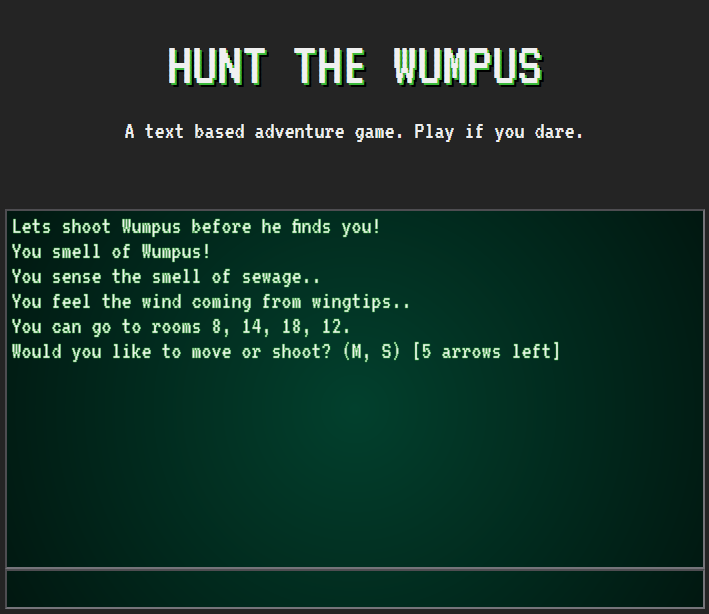
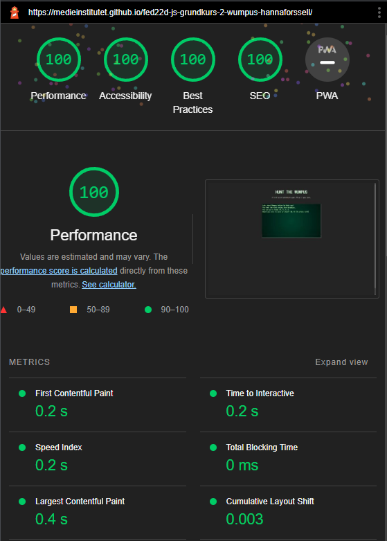
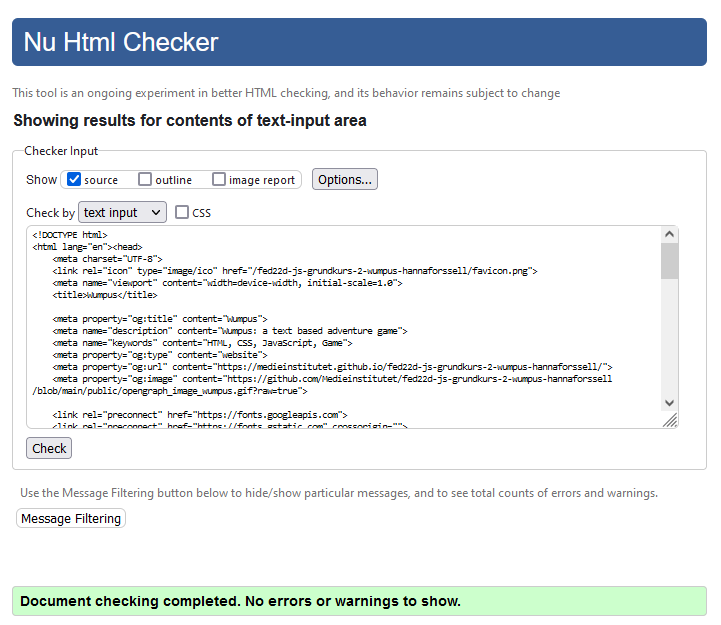
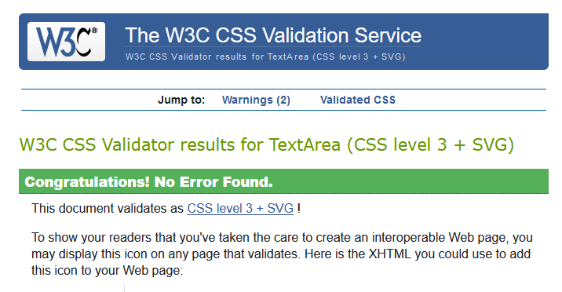

# [HUNT THE WUMPUS](https://medieinstitutet.github.io/fed22d-js-grundkurs-2-wumpus-hannaforssell/)
### Created by: Hanna Forssell.

### Index
1. Description
2. Technologies used
3. Screenshots
4. Lighthouse
5. Validation

#### Description:
I have created my own version of the text based adventure game: [Hunt The Wumpus](https://en.wikipedia.org/wiki/Hunt_the_Wumpus).
You will find the game rules [here](https://github.com/Medieinstitutet/fed22d-js-grundkurs-2-wumpus-hannaforssell/blob/main/GAMERULES.md).
I have also added three new commands:

* **restart** (restarts the game)
* **restart x y** (restarts the game with a new board size)
* **cheat** (toggles a display of the board and relevant information)

#### Technologies used:
* Vanilla JS, HTML, Sass
* Vite, Typescript
* ESLint, Stylelint

#### Screenshots

#### Lighthouse

#### Validation

